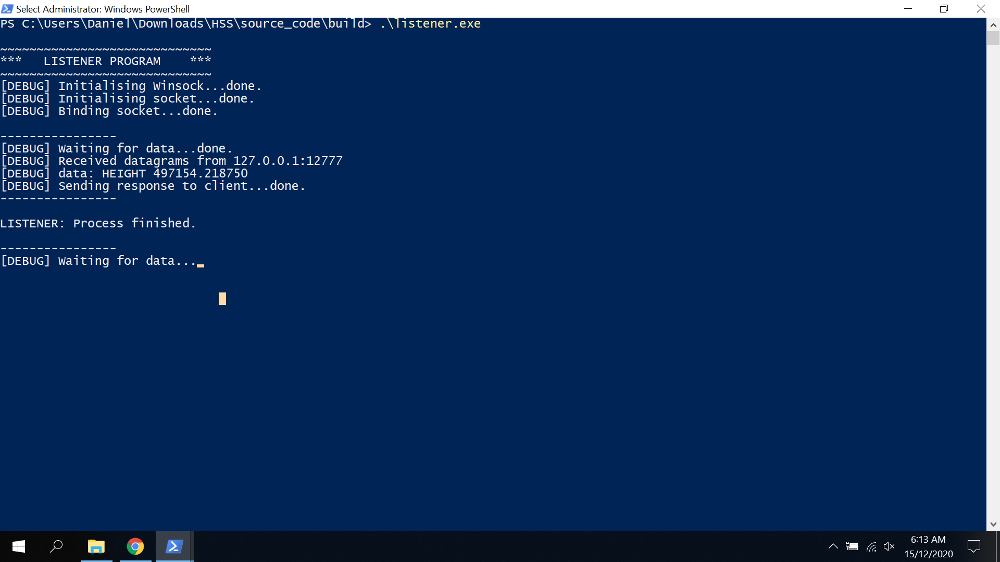
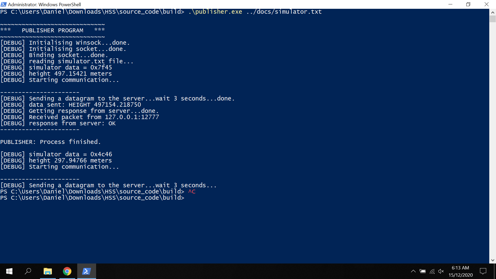

## Height sensing subsystem (HSS)
Description: Implementation of the height sensing susbsytem in C and Windows 10, gcc (x86_64-posix-seh-rev0, Built by MinGW-W64 project) 8.1.0, and CMake version 3.18.0-rc2. 

Design decisions: I usually work in Ubuntu 16.04 but, my current laptop does not let me have two operating systems. On the other hand, I usually work in C++ or Python, but the program was made in C because I thought that was the programming language for this application. This program does not use any classes, just functions (a simple implementation). 


# How works
According to the documentation provided, there are two modules: 

1. listener: 
In this module I defined the UDP server interface to read data from the Lunar lander. It was set to port=12777 and host="127.0.0.1". This program initialize winsock (windows module for socket development), start a socket and then, wait for incoming data. 

2. publisher: 
In this module I defined the UDP client interface to send data from the Lunar lander. It was set to port=12777 and host="127.0.0.1". This program 
initialize winsock (windows module for socket development), start a socket and then, read the simulator file 2bytes-per line, apply a big-endian alignment and then, publish a message to the server.

The height is calculated with the following formula:

```
height = (raw reading/65535)*1000 
```

Then, I check if the height is close to zero to detect a landing event. For eacg LASER_ALTIMETER data from the simulator file, a message is send to the server with the following format:

```
standard reading:

HEIGHT val

landing event:

ENGINE_CUTOFF 0.0000 
```


# NOTE:
I assumed that the simulator file contain the raw readings from one or all of the sensing heads (since I did not find information about this in the documentation). 

# How to compile
Run these commands in the /build folder.

1. create cmake files
```
cmake ../ -G "MinGW Makefiles"
```

2. compile
```
make
```

# How to run program
Open two command lines and:

1. for listener file.
```
./listener.exe
```

2. for publisher file.
```
./publisher.exe <path to simulator file>

e.g.

./publisher.exe ../docs/simulator.txt
```

# Example
<br>
<br>
<video controls>
  <source src="./test/test.mp4" type="video/mp4">
</video>


